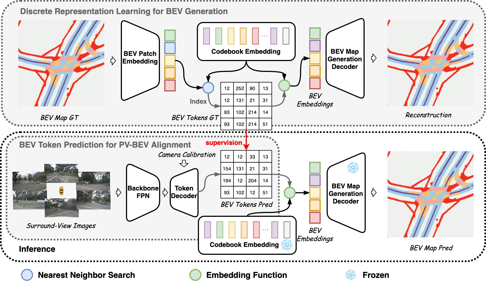

# VQ-Map [NeurIPS 2024]

NeurIPS 2024 paper [VQ-Map](https://arxiv.org/abs/2411.01618) official implement.



## News

- **September 2024**: VQ-Map accepted at NeurIPS 2024 🎉
- **November 2024**: Surround-View BEV layout estimation code is released.

## Abstract

Bird's-eye-view (BEV) map layout estimation requires an accurate and full understanding of the semantics for the environmental elements around the ego car to make the results coherent and realistic. Due to the challenges posed by occlusion, unfavourable imaging conditions and low resolution, *generating* the BEV semantic maps corresponding to corrupted or invalid areas in the perspective view (PV) is appealing very recently. *The question is how to align the PV features with the generative models to facilitate the map estimation*. In this paper, we propose to utilize a generative model similar to the Vector Quantized-Variational AutoEncoder (VQ-VAE) to acquire prior knowledge for the high-level BEV semantics in the tokenized discrete space. Thanks to the obtained BEV tokens accompanied with a codebook embedding encapsulating the semantics for different BEV elements in the groundtruth maps, we are able to directly align the sparse backbone image features with the obtained BEV tokens from the discrete representation learning based on a specialized token decoder module, and finally generate high-quality BEV maps with the BEV codebook embedding serving as a bridge between PV and BEV. We evaluate the BEV map layout estimation performance of our model, termed VQ-Map, on both the nuScenes and Argoverse benchmarks, achieving 62.2/47.6 mean IoU for surround-view/monocular evaluation on nuScenes, as well as 73.4 IoU for monocular evaluation on Argoverse, which all set a new record for this map layout estimation task.

## Results

### Surround-View BEV Layout Estimation (IoU threshold = 0.5)

|      Model     | Dri. | Ped. Cross. | Walkway | Stop Line | Carpark | Divider | Mean |
| :------------: | :--: | :---------: | :------:| :--------:| :-----: | :-----: | :--: |
| VQ-Map         | 83.8 | 60.9        | 64.2    | 57.7      | 55.7    | 50.8    | 62.2 |

### Monocular BEV Layout Estimation (IoU threshold = 0.5)

#### nuScenes

| Model  | Drivable | Crossing | Walkway | Mean |
| :----: | :------: | :------: | :-----: | :--: |
| VQ-Map | 70.0     | 43.9     | 32.7    | 47.6 |

#### Argoverse

| Model  | Drivable |
| :----: | :------: |
| VQ-Map | 73.4     |

## Usage

### Surround-View

#### Prerequisites

```shell
cd vq_map_sur
conda create -n vq-map-sur python==3.8
conda activate vq-map-sur
```

Please following [bevfusion](https://github.com/mit-han-lab/bevfusion) to prepare environment.

Then, compile deformable attention cuda operator:

```shell
cd other/ops
sh ./make.sh
# unit test (should see all checking is True)
python test.py
```

#### Data Preparation for Surround-View Task

```shell
mkdir data
cd data
```

Please refer to [mmdet3d](https://github.com/open-mmlab/mmdetection3d/blob/1.0/docs/en/datasets/nuscenes_det.md) for preparing the data.

After downloading the dataset:

```shell
python tools/create_data.py nuscenes --root-path ./data/nuscenes --out-dir ./data/nuscenes --extra-tag nuscenes
```

The folder stucture after processing should be as below:

```n
├── mmdet3d
├── tools
├── configs
├── data
│   ├── nuscenes
│   │   ├── maps
│   │   ├── samples
│   │   ├── sweeps
|   |   ├── v1.0-trainval
│   │   ├── nuscenes_infos_train.pkl
│   │   ├── nuscenes_infos_val.pkl
```

#### Training

##### For VQ-VAE training

```shell
torchpack dist-run -np 2 python tools/train.py configs/nuscenes/vqvae/codebook128x256.yaml  -p --run-dir workdir/{YOUR_PRETRAIN_EXP_NAME}
```

##### For PV-BEV Alignment training

First, set pretrain_model.checkpoint in the configuration file (e.g., configs/nuscenes/seg/vq-map-512d8l.yaml) to the checkpoint from VQ-VAE training.

```shell
torchpack dist-run -np 4 python tools/train.py configs/nuscenes/seg/vq-map-512d8l.yaml --run-dir workdir/{YOUR_EXP_NAME}
```

#### Evaluation

```shell
python tools/test.py configs/nuscenes/seg/ workdir/{YOUR_EXP_NAME}/{YOUR_SAVED_CHECKPOINT} --eval map
```

### Monocular

The code for monocular experiments is currently being organized and will be released soon.

<!-- ### Monocular TODO

```shell
cd vq_map_mono
```

#### Data Preparation for Momocular Task -->

## Acknowledgements

The surround-view version of VQ-Map is based on [BEVFusion].
It is also greatly inspired by the following outstanding contributions to the open-source community: [Deformable-DETR], [BEVFormer], [BEiTv2], [VQGAN], [PON]

## Citation

If VQ-Map supports or enhances your research, please acknowledge our work by citing our paper. Thank you!

```bibtex
@misc{zhang2024vqmapbirdseyeviewmaplayout,
      title={VQ-Map: Bird's-Eye-View Map Layout Estimation in Tokenized Discrete Space via Vector Quantization}, 
      author={Yiwei Zhang and Jin Gao and Fudong Ge and Guan Luo and Bing Li and Zhaoxiang Zhang and Haibin Ling and Weiming Hu},
      year={2024},
      eprint={2411.01618},
      archivePrefix={arXiv},
      primaryClass={cs.CV},
      url={https://arxiv.org/abs/2411.01618}, 
}
```
